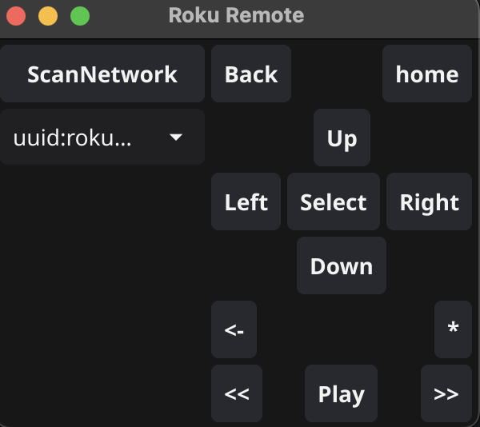

# Roku Remote

The remote was out of reach.

This will find devices on the network using SSDP, which roku devices broadcast on by default. Make sure your device is on the same network.

It will save the device to user preferences every scan, so you'll only need to rescan if the tv gets a new IP address. 

---

I won't consider this complete until I never have to use my normal remote for typing on a TV again. That's my only goal.